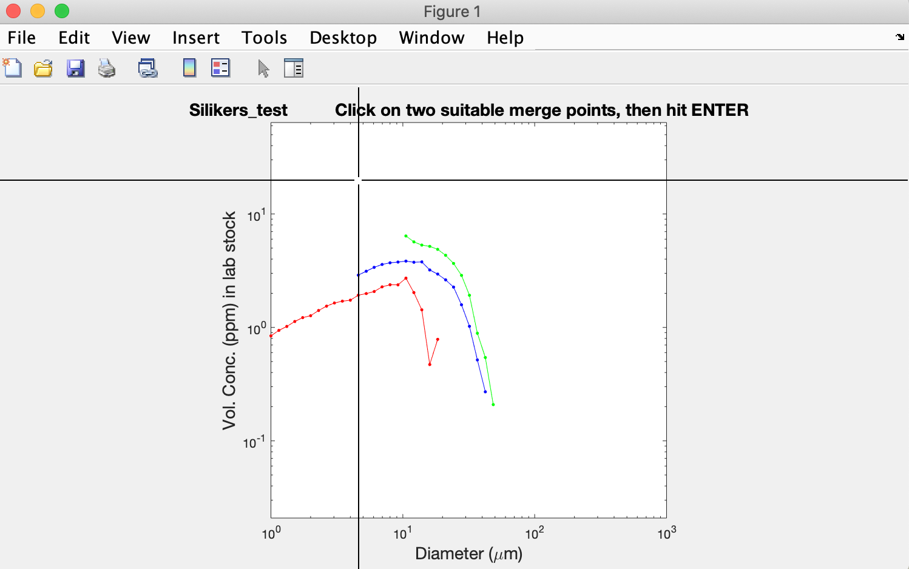
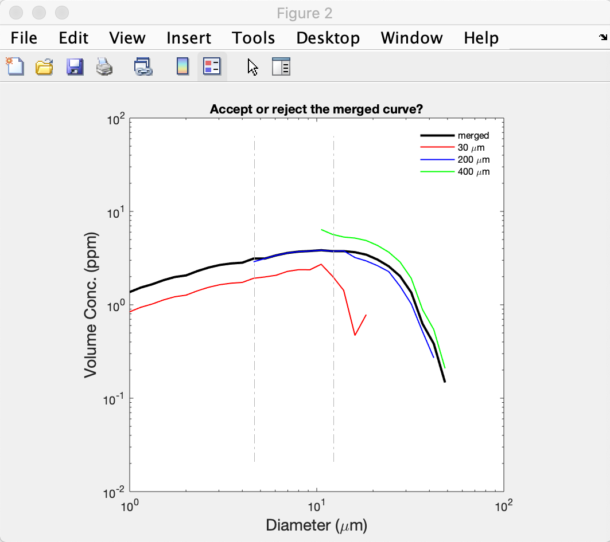
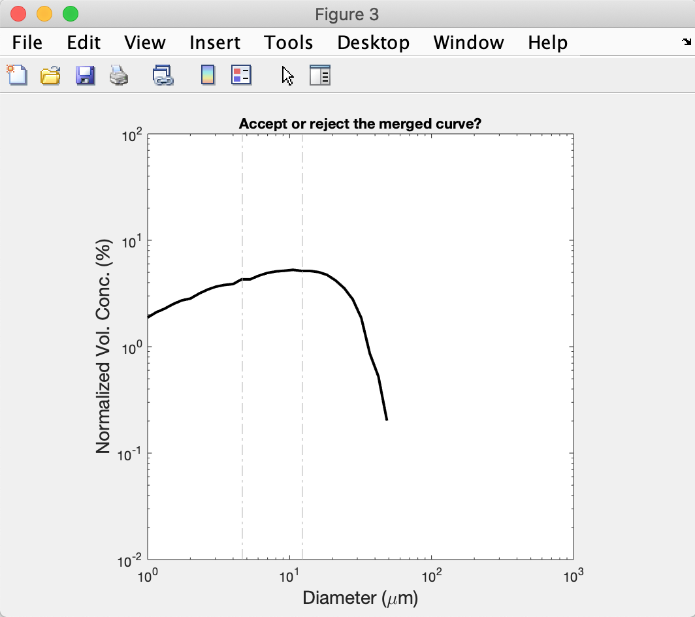
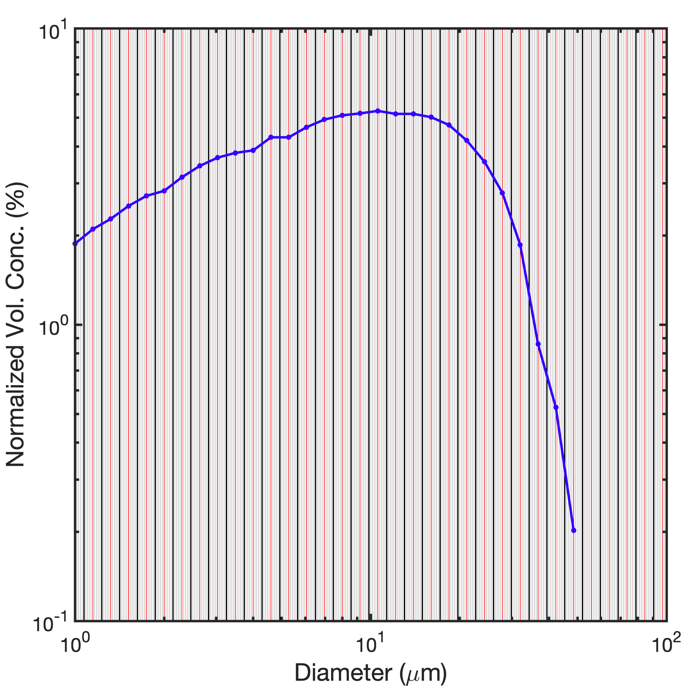

MS3
===

# Overview
The `MS3` folder contains code to merge size distributions obtained with a Multisizer 3, using 2 aperture tubes (30 and 200 &mu;m) or 3 aperture tubes (30, 200 and 400 &mu;m). Sample Multisizer 3 output files are provided in the folder `ToMergeProcessor`. The code provided is designed to work with this specific output format and naming convention. Sample dilution sheets are also provided in the folder `Dilutions` to allow for calculations of particle concentrations (optional).

When no dilution sheets are included for a sample, the script merges particle size distributions using relative particle volume (% volume; normalized to 100%), assuming equivalent spherical diameters. When dilution sheets are included, the script merges particle size distributions using their concentrations in parts per million (ppm).

Currently, the merging code is provided in the form of a Matlab script entitled `MergeProcessor.m` in the folder `MS3/Matlab`. The script was originally written in the Hill Lab at Dalhousie University by John Newgard with input from Jessica C. Garwood. We anticipate also making R (near-future) and Python (eventually) codes available.

# Folders
- `Dilutions`: put dilution sheets corresponding to files to be merged in this directory (optional). Follow format of sample files.
- `ToMergeProcessor`: put Multisizer 3 output files in this directory. All files within the folder will be merged so it is important to remove previously merged files. Follow format of sample files. Note .csv format.
- `Matlab`: this directory contains the main merging script (`MergeProcessor.m`) and all necessary functions.
- `MergedData`: merged distributions (with figures) are saved in this location.

# Using this code
1. Download the `MS3` folder from `https://github.com/JessCG/MS3.git` 
2. In order to calculate particle concentrations, the flow rate specific to an instrument and aperture tube combination must be calculated. Refer to the Multisizer 3 User Manual to do so and modify the `MS3_flowrates.txt` file (found in the `MS3` folder) accordingly. This step only needs to be done once per aperture tube.
3. Transfer all Multisizer 3 output files to be merged into the directory called `ToMergeProcessor`.
4. Open Matlab and navigate to the `MS3/Matlab` directory.
5. Run the script `MergeProcessor.m`.
6. Using the cursor, select the point where the particle size distributions obtained with the 30- and 200-&mu;m aperture tubes should be merged. Only the position of the cursor along the x-axis is important.

**Figure 1.** Screenshot of a user selecting the merge point for the grain size distributions obtained with the 30- (red) and 200-&mu;m (blue) aperture tubes. Only the x-position of the cursor is considered by the code.

7. Repeat for the 200- and 400-&mu;m aperture tubes if applicable.
8. If satisfied, approve the selection by pressing `enter` or type `n` then press `enter` to try again.

**Figure 2.** Screenshots showing a merged grain size distribution (black) using volume concentration (left) or volume percent (right) for the test Silikers distributions provided with this code. Note that when using concentrations, the distributions obtained with the 30- (red) and 400-&mu;m (green) aperture tubes are brought to the distribution obtained with the 200-&mu;m (blue) aperture tube. The grey vertical lines show the points where the distributions were merged.

9. Repeat for every sample.
10. The merged particle size distributions can now be found in the `MergedData` directory.

# Size bins (&phi; increments)
The particle size distributions reported by the Multisizer 3 are in &mu;m, but we set the bin limits using 1/50-&phi; increments, where &phi; = -log2(d/1000) and _d_ is the particle diameter in &mu;m.

Although we set the Multisizer 3 output to 1/50-&phi; increments, particle size distributions obtained with earlier versions of the instrument were reported in 1/5-&phi; increments. To be consistent with previously reported particle size distributions, the `MergeProcessor` code  combines 10 Multisizer 3 bins (dubbed _small bins_) for each bin in the merged distributions (dubbed _merged bins_). To have a defined mid-point after combining 10 small bins, the Multisizer 3 output is set using lower bin edges (i.e., the lower bin edge of the 6th small bin becomes the mid-point of the merged bin).

**Figure 3.** Merged grain size distributions (blue line; dots show the mid-points of merged bins) for the test Silikers grain size distributions provided with this code. Vertical lines show the lower edges of the small bins (grey) with one in ten showing the **edges** of the merged bins (black) and the **mid-points** of the merged bins (red).
